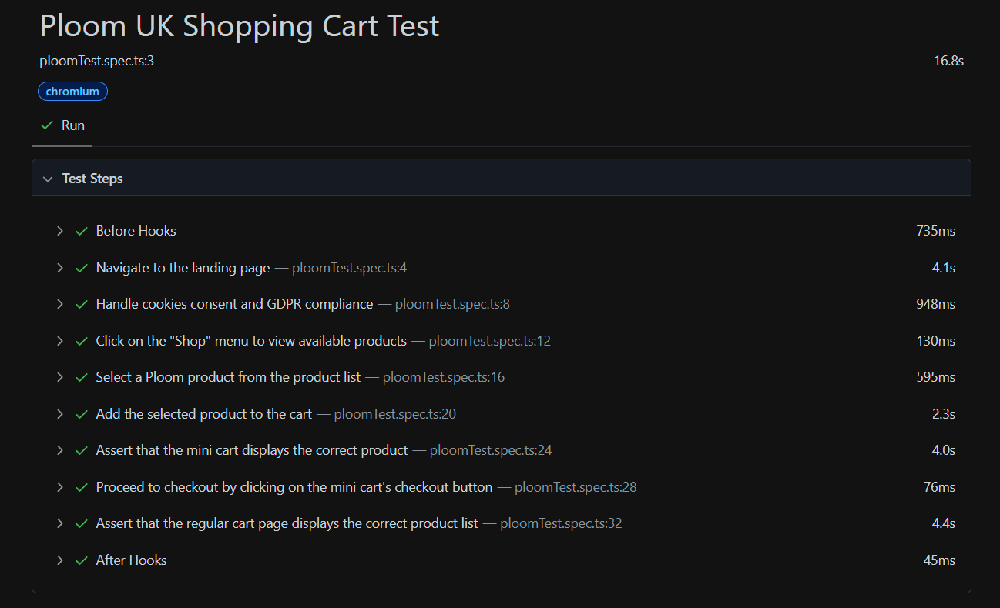

# Ploom Project - Playwright Testing

This project contains automated tests for the Ploom UK website using Playwright and TypeScript.

## Project Structure

```
ploomproject/
├── pages/
│   ├── cartPage.ts        # Page Object for the Cart page
│   ├── landingPage.ts     # Page Object for the Landing page
│   ├── productPage.ts     # Page Object for the Product page
│   └── shopPage.ts        # Page Object for the Shop page
├── tests/
│   └── ploomTest.spec.ts  # Main test file containing test scenarios
├── fixtures.ts            # Custom test fixture setup
├── .eslintrc.js           # ESLint configuration
├── .prettierrc            # Prettier configuration
├── env.example            # Example environment file
├── package.json           # Node.js dependencies and scripts
├── tsconfig.json          # TypeScript configuration
└── README.md              # Project documentation
```

## Getting Started

### Prerequisites

Ensure you have the following installed:

- Node.js
- npm or yarn package manager

### Installation

1. Clone the repository:

   ```bash
   git clone https://github.com/iacretan/ploomproject.git
   cd ploomproject
   ```

2. Install dependencies:

   ```bash
   npm install
   ```

3. Set up environment variables:

   - Copy the `env.example` file to `.env`.
   - Update the `BASE_URL` variable with the base URL for the website you want to test.

   ```bash
   cp env.example .env
   ```

### Running the Tests

To execute the tests, run:

```bash
npx playwright test
```

### Running Specific Tests

You can run specific tests by specifying the file or using tags within the test files.

Example:

```bash
npx playwright test tests/ploomTest.spec.ts
```

### Report example



### Project Scripts

The project includes several useful scripts:

- **Linting**: Automatically fix linting issues with ESLint.

  ```bash
  npm run lint
  ```

- **Formatting**: Format the code using Prettier.

  ```bash
  npm run format
  ```

### Custom Fixtures

This project extends Playwright's base test to include Page Object Model (POM) instances for easier and cleaner test writing. These fixtures are defined in the `fixtures.ts` file and include the following pages:

- **CartPage**: Interacts with the shopping cart page.
- **LandingPage**: Handles the landing page interactions, including cookie consent.
- **ProductPage**: Manages product selection and mini cart assertions.
- **ShopPage**: Handles navigation and product selection within the shop menu.

### Development Workflow

1. Write or update the test in the `tests/` directory.
2. Run `npm run lint` to check for linting errors.
3. Run `npm run format` to format the code.
4. Run `npx playwright test` to execute all tests.
